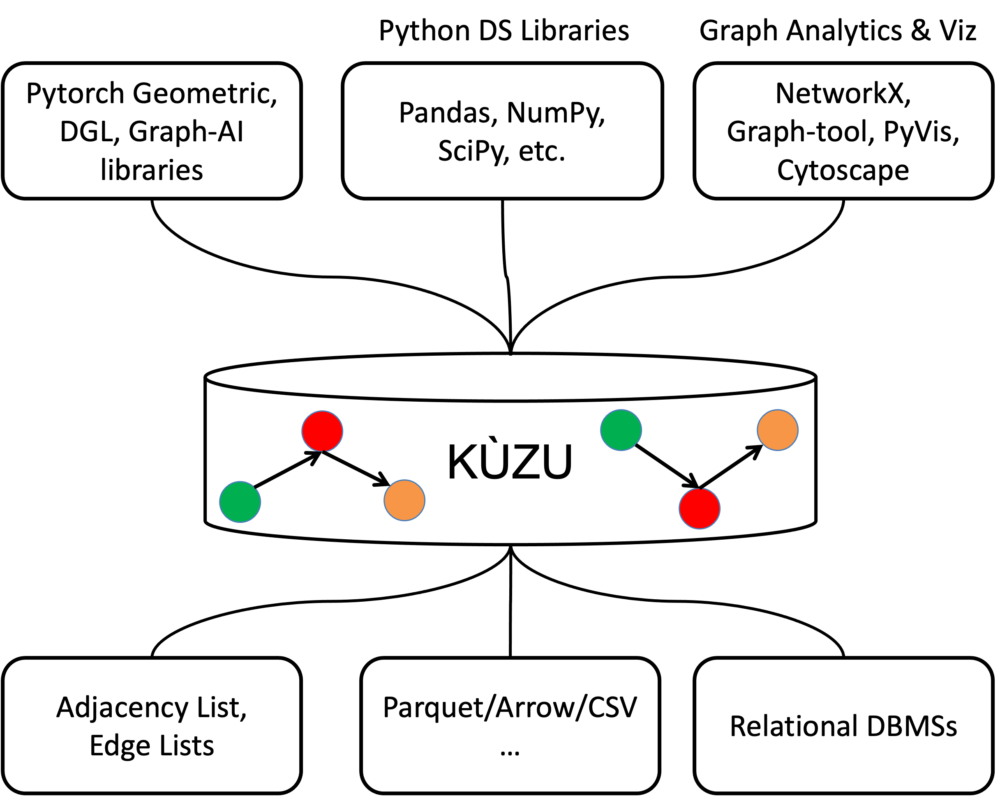

import BachmannImage from './bachmann.png';
import DiamondPatternImage from './diamond-pattern.png';
import ExFwdJoinIndexImage from './ex-fwd-join-index.png';
import KuzuAsGDBMSOfGDSImage from './kuzu-as-gdbms-of-gds.png';


# What Every Competent GDBMS Should Do (aka The Goals & Vision of Kùzu
As a co-implementor of the Kùzu GDBMS and
a professor at University of Waterloo,
I have been thinking of GDBMSs day in and day out for many years now.
After years of understanding and publishing on the architectural principles 
of graph data management ([1](http://www.vldb.org/pvldb/vol12/p1692-mhedhbi.pdf), 
[2](https://www.vldb.org/pvldb/vol14/p2491-gupta.pdf), 
[3](https://www.vldb.org/pvldb/vol15/p1011-jin.pdf),
[4](https://www.vldb.org/pvldb/vol15/p1533-chen.pdf)),
we decided to develop 
[Kùzu](https://github.com/kuzudb/kuzu) as a state-of-the-art modern embeddable GDBMS. 
This post covers my broad opinions on GDBMSs, and the feature set they should
optimize for and why. In doing so, it also gives an overall vision of Kùzu!

<!--truncate-->

:::tip Tldr: The key takeaways are:
- **Overview of GDBMSs**: GDBMSs are relational in their cores but offer an elegant graph model
  to model application data and SQL-like query languages with elegant
  graph-specific syntax. Many applications, e.g., in [fraud detection](https://tinyurl.com/3x89ceum), 
  [recommendations](https://www.tigergraph.com/solutions/recommendation-engine/),
  [personalization](https://tinyurl.com/3z9bckmm), etc. benefit from such modeling and query language features.
- **Key Feature Set of GDBMSs**: Despite being relational, GDBMSs optimize (or at
  least they should!) for a distinct set of
  features/use cases that RDBMSs do not traditionally optimize for: (i) pre-defined/pointer-based joins;
  (ii) growing many-to-many joins;
  (iii) recursive joins;
  (iv) schema querying; 
  (v) efficient storage of semi-structured data and URIs.
   GDBMSs that want to be competitive in terms of performance
  need to perfect this feature set and that's exactly what Kùzu aims to do!
- **Kùzu as the GDBMS for Graph Data Science**: 
  One example application domain the Kùzu team is excited about is 
  to be a usable, efficient, and scalable GDBMS of graph data science in the Python graph analytics ecosystem. 
  Here we are looking at how DuckDB revolutionized tabular data science and
  want to repeat it in graph data science! 
:::


This week, I presented Kùzu to the database community at the [CIDR 2023](https://www.cidrdb.org/cidr2023/papers/p48-jin.pdf) 
conference in Amsterdam. For those who are not familiar with academic database conferences, 
CIDR brings together work from academia and industry to discuss recent research on 
systems aspects of database technology. Our paper was about Kùzu's 
goals and vision and its core query processor design for evaluating complex growing joins.
We intentionally targeted CIDR for our paper because of its systems 
focus and we thought many system gurus would be there: the attendees included 
creators of [MonetDB](https://www.monetdb.org/), [Vectorwise](https://en.wikipedia.org/wiki/Vectorwise), 
[DuckDB](https://duckdb.org/), 
[Snowflake](https://www.snowflake.com/en/), [Databricks](https://www.databricks.com/), amongst others. It also meant a lot to share 
our ambitious goal of developing a usable GDBMS from an academic setting in this CIDR because
it was  organized locally by CWI. The late [Martin Kersten](https://en.wikipedia.org/wiki/Martin_L._Kersten) 
founded the CWI database group and was a pioneer of this style of research projects and 
his successors are continuing this tradition very successfully today. 
CWI has created many successful DBMSs, including MonetDB (Martin's legacy), Vectorwise, and 
most recently DuckDB. People paid their respects to Martin during an emotional memorial 
on the first night of the conference.
As a surprise, [MemGraph](https://memgraph.com/) co-founder and CTO  [Marko Budiselić](https://www.linkedin.com/in/markobudiselic/) 
was also there (it was his first CIDR)! Marko is an extremely friendly 
and humble person you should meet and it was great to share our insights about where GDBMSs make a difference in 
enterprise applications.

I want to start a 3-part blog post to cover the contents of our CIDR paper in a less academic language: 
- Post 1: Kùzu's goals and vision as a system 
- Post 2: [Factorization technique for compression](../2023-01-20-factorization/index.md)
- Post 3: [Worst-case optimal join algorithms](../2023-02-22-wcoj/index.md)

In this Post 1, I discuss the following: 
   (i)   [an overview of GDBMSs](#overview-of-gdbms-and-a-bit-of-history).
   (ii)  [the features GDBMSs should optimize  for and why;](#features-every-competent-gdbms-should-optimize-for-) and 
   (iii) [an example application domain (graph data science!) we are immediately targeting with Kùzu. ](#kùzu-as-a-gdbms-for-graph-data-science-pipelines)
(ii) and (iii) should give you a good idea about the current goals and 
vision of Kùzu. If you know GDBMSs well, you should skip over (i).

## Overview of GDBMSs and a Bit of History 
In one sentence, GDBMSs are read-optimized analytical DBMSs for modeling and querying application 
data as a graph. As a consequence they are optimized for fast querying of node and 
relationship records. 
Modern GDBMSs, such as Neo4j, Tigergraph, MemGraph, or Kùzu, 
adopt the [property graph data model](https://neo4j.com/developer/graph-database/#property-graph)
(or its variants), where you can model your records as a set of labeled nodes and 
edges/relationships, and key-value properties on these relationships. When
I say GDBMSs in this post, I specifically refer to the systems that adopt this
model but I will also discuss [RDF systems](https://en.wikipedia.org/wiki/Triplestore) (aka triplestores) 
here and there, which are also DBMSs that adopt a graph-based model.

Here's a side comment that I have to make because I'm a professor and
professors are always ready to profess.
DBMSs based on graph models are anything but new. They have existed even before the relational
model: DBMS die-hards love remembering 
that the [IDS system](https://en.wikipedia.org/wiki/Integrated_Data_Store) from 1960s was based on the "network model",
which is is just another term for graph. IDS was lead by the amazing 
Charlie Bachmann,  [1](https://amturing.acm.org/award_winners/bachman_9385610.cfm),
[2](https://youtu.be/iDVsNqFEkB0), [3](https://youtu.be/jByIpJNrm50)), whose photo is shown on the left and who is credited for inventing DBMSs[^1].
If you click on [this 1962 ad of the IDS system](http://wp.sigmod.org/wp-content/uploads/2012/12/image4.jpg), you will see a graph of node and 
edge records. Note 1960s are pre-relational times. Ever since, every decade has seen a surge of DBMSs 
that adopted a graph-based model with mixed levels of adoption success:
hierarchical model, XML, and RDF are examples.
In my view, current property GDBMSs is the most generic
and suitable to model a very broad range of application data out of these.
So they probably established themselves most successfully out of these. 
There is a very fundamental reason why graph-based DBMSs have always existed and will
always exist: graphs and tables are the two most natural and generic abstract data structures 
to model application data. It's no surprise they were the first two proposed data models
when the field of DBMSs were born and both have existed ever since and will continue to exist.

Back to property GDBMSs. How about their query languages? They support SQL-like high-level 
query languages with several graph-specific syntax. 
I call them "graph-specific" SQL. Let's look at a query snippet. Assume this is
on a database that models a set of financial "accounts" and money "transfers"
between accounts:

```
MATCH (a:Account)-[e:Transfer]->(b:Account)
WHERE a.name = 'Alice'
RETURN b.ID
```
This is a query expressed in Cypher. Instead of a SELECT/FROM/WHERE, 
you are looking at MATCH/WHERE/RETURN. 
If intelligent Martians saw Cypher and SQL, their immediate reaction 
would not be to notice the minor syntactic differences but instead
the fundamental similarities:  their clauses describe joins,
filters, projections, group by and aggregates, and other relational 
operations that process sets of tuples.
There is of course syntactic differences that are important. Query languages of 
GDBMSs adopt graph-specific syntax that are often very elegant to express several computations.
For example, the arrow syntax ((a)-[e]->(b)) in Cypher describes joins between node records. This
is much more elegant than listing names of tables that model 
node records in a FROM clause, with a complex WHERE clause. 
Much more importantly, they adopt a very elegant and direct syntax,
such as the Kleene star "*", to 
express recursive queries. Expressing recursive computations with vanilla SQL is 
objectively harder. I'll come to recursive queries later.


Now get ready for a blasphemous observation: *GDBMSs are relational at their cores!*[^2]. 
Well, OK anyone who has studied the principles of DBMSs knows there is nothing 
blasphemous here because GDBMSs actually have to be relational
because of this simple fact: 
*the only known practical way to implement declarative high-level
query languages is to compile them to relational operators that
take in and output sets of tuples*. Type "Explain" to any of your
queries in your favorite  GDBMs (or RDF system) and look at their query plans and
you will see joins, scans, filters, projections, group bys, unions,
intersections, etc. You might see some graph-specific operators
but they will also be processing sets of tuples. That was the primary
observation of [Ted Codd](https://en.wikipedia.org/wiki/Edgar_F._Codd) when he proposed
that data management should be done by systems implementing
relational operators that process sets of tuples. 

But don't worry, I do love GDBMSs and you should too! The fact that at their cores 
GDBMSs are relational doesn't mean they don't offer value beyond RDBMSs.
DBMSs are very complex software systems and they make a ton of design tradeoffs in terms of
what they optimize for. There is a very distinctive set of technical features that 
GDBMSs should optimize for and excel in, where RDBMSs and SQL traditionally don't.
This feature set is exactly what 
Kùzu aims to perfect over time, which is what I hope to articulate in this post.
In short: GDBMSs do offer a ton of value if 
they are architected correctly and every software engineer should know 
about GDBMSs[^3].

## Features Every Competent GDBMS Should Optimize For [^4]
Here is a list of features that differentiate GDBMSs from RDBMSs and GDBMS should
highly optimize for and support.

### Feature 1: Pre-defined/pointer-based Joins
This is perhaps the most ubiquitously adopted technique in GDBMSs that is ubiquitously missing in RDBMSs. 
Although GDBMSs
can join arbitrary node records with each other, most common user queries in GDBMSs
join node records with their "neighbors". A GDBMS knows about these
neighbor node records because they are predefined to the system as relationships.
So GDBMSs universally exploit this and optimize for these types of joins. For example,
almost universally they all create a **join index** (aka an adjacency list index)[^5].
Here's a demonstrative example showing a "forward", i.e., from src to dst, join index:


Note that the join index does not store the actual data values, which
are strings (e.g., "Ali", "Noura", etc.) in the example. Instead, 
it stores dense system level node record IDs.
As a result, GDBMSs can be fast on these joins because they can use: (1) the join index;
and (2) dense integer IDs to joins (instead of, say running string equality conditions). 

### Feature 2: Many-to-many Growing Joins
In many application data stored on GDBMSs, node records
have many-to-many relationships with each other. Think of any data as a graph, 
say a network of financial transactions or who bought which items or
who is friends with whom. In many of these datasets, an entity/node connects with 
many other nodes. In addition, many of the killer apps of GDBMSs search for complex patterns
on these relationships. 
A classic example we like using is a Twitter friend recommendation engine that is looking for diamond patterns to implement
the following rule: If a user A follows two users B and C, who both follow D, recommend
D to A. This is the pattern:

<div class="img-center">

</div>


The whitepapers of existing GDBMSs are full of these patterns, e.g., branching trees, money laundering circles,
cliques of customers who buy similar items, etc. These correspond to complex
many-to-many joins, which by their nature are growing. If on average each of your nodes 
connect with k other nodes and you have t many relationships in the pattern you are searching,
you are asking a system to search through k^t many possible combinations and guess what: exponential 
functions are scary. We have been advocating the integration of 2 specific techniques
into the query processors of GDBMSs for several years now: (i) factorization; and (ii) worst-case optimal joins.
Both of these techniques are specifically designed for 
many-to-many growing joins and we have integrated them in Kùzu. Stay tuned for for my next two posts on this. 

### Feature 3: Recursive Join Queries
This is probably the most obvious feature where GDBMSs should excel in. First, objectively 
the query languages of GDBMSs have much better support
for recursive join queries than SQL. Consider this query on our previous financial transaction network
example: "Give me all direct or indirect money flows into Alice's account from Canada." Now
look at this elegant way to ask this in Cypher using the Kleene star '\*':
```
MATCH (a:Account)-[:Transfer*]->(b:Account)
WHERE a.country = 'Canada' and b.name = 'Alice'
RETURN a.ID
```

Similar to regexes, '\*' represents possible 1 or more repetitions of the Transfer
edge in the join. So the join could be a direct join between (a) and (b) or a 2-hop one,
or a 3-hop one etc. You can do this with SQL of course, but it's objectively harder. Recursion
has been an afterthought when standardizing SQL. It came 20 years after SQL standardization started and is really a hack. 
In contrast, recursion has been first-class citizen
feature in every graph-based DBMS's query language.
This distinction is even much more visible
if you want to do other graph-specific recursive computation, such as finding shortest paths.
In  Kùzu, we are starting to work on implementing 
and optimizing recursive query support and we hope to have first a basic version and 
then optimized versions that hopefully works very well and contributes to the principles of how these
queries should be evaluated.

### Feature 4: Schema Querying 
Another important feature of GDBMSs that cannot be done in
RDBMSs is that the query languages allow querying the schema of a database in addition
to the data in the database. Suppose in a modified financial transaction network, 
there are three relationship types: Wire, Deposit, and ETransfer and you 
you wanted to search for a path where the first edge and the second edge types
are different. Note that the predicate is *on the schema*, specifically on the type 
of the nodes/relations. You can write the following query:
```
MATCH (a:Account)-[e1]->(b:Account)-[e2]->(c:Account)
WHERE type(e1) != type(e2)
RETURN *
```

Something akin to this cannot directly be done in SQL. One would have to write a query
that unions many sub-queries: one that joins node records over Wire and then Deposit,
another on Wire and ETransfer, another on Deposit and then Wire etc. This will be 
messy. The ability to *not* specify a label on relationships, 
specifically on e1 and e2, is an
elegant way to effectively express such unions of join queries.
It says: "join a and b nodes over every possible relationship".
The `type()` function on these variables allows doing querying over the schema.

### Feature 5: Semi-structured Data and URI-heavy Datasets (e.g., "Knowledge Graphs")
An important application domain of GDBMSs 
is "knowledge graphs". This term means different things 
in different contexts and I'll take it
to refer to highly heterogenous datasets that are
often naturally modeled as RDF triples. Again, I don't want to go into the 
details of this model but I assume many readers will already be familiar with
RDF. RDF is a simple data model where data is represented as (subject, predicate, object)
triples that represent facts about a domain. A great application is when modeling and
querying encyclopedic facts, such as those extracted from Wikipedia data.
For example, the following triple stores the fact
that Justin Trudeau is married to Sophie Trudeau:
(http://dbpedia.org/resource/Justin_Trudeau, http://dbpedia.org/ontology/spouse,	
http://dbpedia.org/resource/Sophie_Grégoire_Trudeau). 
There are 2 immediate challenges for a DBMS to manage 
such data: 
1. Structuring such datasets is very difficult. Structuring here
refers to designing a relational schema for the data.
Entities can have many types, e.g., Justin Trudeau is both a "rdf:type" 
http://dbpedia.org/ontology/Person as well as
http://dbpedia.org/ontology/Politician. Further, within a single type, entities can have many different
and distinct properties, so good luck coming up with and maintaining a relational 
schema for all that. 
This is a direct result of
the overly ambitious domain the dataset is modeling: all encyclopedic human knowledge!
You need a data model that allows flexibility in what can be associated with entities
and their types[^6].

2. Those long strings used to identify entities, e.g., Justin
Trudea, are called URIs (for universal resource identifiers),
and queries will frequently access and specify them. So systems should
be competent in handling those.

GDBMSs tend to support semi-structured schemas and certainly RDF systems
have good techniques to handle URIs. 
These applications are directly in the realm of graph-based DBMSs.
Currently, they are directly targeted by RDF systems but I'm convinced 
GDBMSs should also implement techniques to efficiently support them[^7]. 

**Final note on the above feature set:** I referred to several classic applications but 
many other applications require and benefit
from the above feature set.  One can
think of the dataset and workloads of these applications as the "beyond relational/SQL" datasets/workloads, which
often require modeling and querying in a graph-based DBMS, and
we want Kùzu to excel in and represent the state-of-art in this feature set! 

## Kùzu as a GDBMS for Graph Data Science Pipelines

Finally, let me tell you a little bit about 
a particular application domain we are currently excited
about and we want to see Kùzu used in: graph data science in the python ecosystem!
This figure from my CIDR slides describes this vision pictorially:



Suppose you are building a graph analytics, machine learning, or visualization
pipeline from raw record files on disk. You will want to model your raw records 
as nodes and edges, clean them, extract features, query them, transform them, 
and then you will extract data to an upstream python library, such as Pytorch Geometric, DGL, 
NetworkX or a graph visualization library. 
You might even want a pipeline
that extracts regular tables from your graphs to a tabular data science library, 
such as NumPy,
since the outputs of queries in Cypher are tables of records.
We want people to use Kùzu as an embeddable library in their Python scripts, 
to do their modeling, querying, feature extraction, 
cleaning, and other transformations, all by benefiting from a high-level query language 
and state-of-art graph data management techniques
that we are implementing. This is exactly what DuckDB did for tabular data science/analytics.
We are looking at DuckDB here and want to fill the same gap for graph data science/analytics!
We are currently understanding the ecosystem better and appreciate feedback
and suggestions for features we should implement to enable your workloads.

OK, this is it for now. In the next two blog posts, I will discuss 
factorization and worst-case optimal join algorithms and describe 
some of the principles that we adopted in Kùzu's query processor.
Until then, happy new years from the cold but cozy winter of 🇨🇦 
and [pip install kuzu](https://github.com/kuzudb/kuzu)!

[^1]: Interestingly, Bachmann is one of a handful of Turing laureates without any academic career. If you love DBMSs, [listen to this talk](https://youtu.be/iDVsNqFEkB0)  where he remembers his IDS days! Amusingly, he also talks about how he didn't know who Turing was when got the Turing award and how he met Turing's mother in England for tea 😀.

[^2]: When I say GDBMSs here, I'm referring to the core engines that implement the high-level languages of these systems and not the analytics libraries (e.g., [1](https://neo4j.com/product/graph-data-science/), [2](https://memgraph.com/mage)) above these core engines that run iterative graph analytics computations, such as finding connected components, or PageRank, or betweenness centrality. These computations are better understood through either direct graph formalisms or linear algebra (and not relational) operations.

[^3]: I am a strong supporter of devoting a few lectures to GDBMSs after covering the fundamental topics on the relational model and RDBMSs in core introduction to DBMSs courses in undergraduate curriculums. Students should broaden their perspectives on the available data models and query/programming languages to them when they develop applications. GDBMSs is an obvious choice here. So is Datalog and RDF/SparQL.

[^4]: We articulated this list of features in our CIDR 2023 paper. Incidentally, [a paper](https://www.cidrdb.org/cidr2023/papers/p66-wolde.pdf) written by CWI on a graph query extension to DuckDB, had a 12-item list of "techniques" that GDBMSs should implement at their cores. Let me call this the CWI list. These items are not features in the sense I'm using the word, so I call them techniques. As you'll see my features are higher-level system properties from user's perspective. Peter Boncz, who is renowned in the field for having written or advised many successful DBMSs that spinned off, presented the CWI paper. I highly recommend this as another reading if you want to know more about Peter and his co-authors' technical insights about how GDBMSs should be architected. Importantly, Kùzu has integrated or is in the process of integrating 11 of the 12 techniques in the CWI list(bulk path finding is the one we have to do more thinking on) and our prior publications had also articulated many of these insights,  such as the fact that [GDBMSs should be columnar systems](https://www.vldb.org/pvldb/vol14/p2491-gupta.pdf) doing vectorized querying and of course we did a ton of work on [worst-case optimal joins](https://www.vldb.org/pvldb/vol12/p1692-mhedhbi.pdf) and [factorization](https://www.cidrdb.org/cidr2023/papers/p48-jin.pdf), which are also in the CWI list. I should acknowledge that Peter had been advocating for some of the techniques on the CWI list at least since 2018. I remember a presentation he gave in 2018 to GDBMSs researchers and developers titled "Why are Existing GDBMSs Incompetent?", which listed some of the techniques in the CWI list and visibly has inspired the title of this blog.

[^5]: Although some refer to these as an "adjacency list index" because that's a common term in graph terminology, I need to pay my respects to the giants in the field: these are plain old [1980s Valduriez join indices](https://dl.acm.org/doi/abs/10.1145/22952.22955). And no, they were invented in the context of RDBMSs. That said, they never found much adoption in RDBMSs. But they are almost universally adopted in GDBMSs.

[^6]: Designing the schema, i.e., defining the types of entities and relationships and class structures and constraints of such complex domains can be decades of work. What I'm referring to as schema is called an "ontology" in knowledge graph/semantic web space. If you ever thought you modeled a hard application domain, take a look at [SNOMED](https://en.wikipedia.org/wiki/SNOMED_CT), which is a decades long effort to model and standardize human medical knowledge. Last term, I had a seminar on SNODEM in my graduate course on knowledge graphs and students were baffled by the complexity of this "ontology", which  describes the types of entities and their relationships and constraints, which RDF technology stack is quite good at.

[^7]: Before we released Kùzu, we had support for adding arbitrary node/edge properties but we removed a large chunk of code out of the system to release a thinner code base. So currently you need to specify a schema for your nodes and relationships in Kùzu. We will wait and see if/when that demand comes and how strongly it comes. We know from our conversations with many users and developers of GDBMSs over the years that most datasets in enterprises are not this complex and can be structured. At least after a proof of concept phase of applications, developers structure their data.