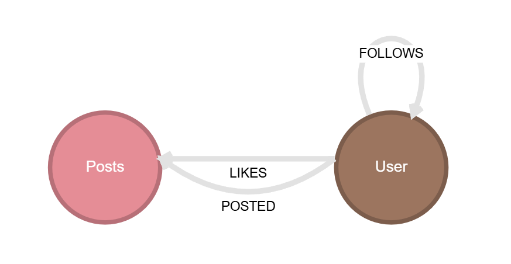

In this section, we link to some learning resources to become more familiar with Kùzu's usability
features, Cypher and its integration with the Python data science and machine learning ecosystem.

import { CardGrid, LinkCard } from '@astrojs/starlight/components';

## Getting started with Kùzu

If you're new to graph databases and Cypher, we recommend getting started with our
[introductory video playlist](https://www.youtube.com/playlist?list=PLnMU6rfAdE1CSgarQ3SpDqeudCe42PzuD)
that covers the basics of Cypher and how to get started with Kùzu.
Click on the link below to watch one of the videos, and subscribe to our YouTube
[channel](https://www.youtube.com/@Kuzudb) for more such content.

  <iframe
    height="480"
    src="https://www.youtube.com/embed/wV2iphFc_f0"
    title="YouTube video player" frameborder="0"
    allowfullscreen
    >
  </iframe>

## Python notebooks

For Python users, we've compiled a series of notebooks on Google Colab that demonstrate how Kùzu can
be used and integrated with the Python data science and machine learning
ecosystem. Click on the links below to open and run the notebooks.

<CardGrid>
  <LinkCard
    title="Intro to Cypher"
    description="Become familiar with Cypher syntax"
    href="https://colab.research.google.com/drive/1zgTCEOFdskYRQ45COYRww7sA6fTXE66S"
  />
  <LinkCard
    title="Kùzu and NetworkX"
    description="Working with NetworkX & graph algorithms using a Kùzu graph"
    href="https://colab.research.google.com/drive/1_AK-CHELz0fLAc2RCPvPgD-R7-NGyrGu"
  />
  <LinkCard
    title="Kùzu and PyTorch Geometric (1)"
    description="Node property prediction"
    href="https://colab.research.google.com/drive/1ijFoPN4USr4umUzRoCfRPFNZfbhKKLcC"
  />
  <LinkCard
    title="Kùzu and PyTorch Geometric (2)"
    description="Link prediction"
    href="https://colab.research.google.com/drive/1OxlDLUYZL8jTkqKdVebFtek7yZ5of7FK"
  />
  <LinkCard
    title="LlamaIndex-Kùzu Integration"
    description="Using Kùzu as a property graph store for LlamaIndex"
    href="https://colab.research.google.com/drive/1brAdNRNLG2XHD7Jv3ZwSQCOCJ_wmfd1B"
  />
  <LinkCard
    title="LangChain-Kùzu Integration"
    description="Using Kùzu as a property graph store for LangChain"
    href="https://colab.research.google.com/drive/16FscFHwSKQNXFprChdQufMP7G6u8cMTS"
  />
</CardGrid>

## Other language tutorials:
For toher language APIs which Kùzu supports, we will be using the following dataset to explore the extensive abilities which graph database is able to provide.

The network which we will be using in this tutorial is suppose to simulate a community of users in a social network. The data for the network is in this [zip file](https://rgw.cs.uwaterloo.ca/kuzu-test/tutorial/tutorial_data.zip).

The schema of the community is of follows:

## Nodes
### **User**: 
The User node represents users within the social network. Each user has their information attached, such as:
- **user_id** (INT64): This is an unique id which is used to sort and find users. 
- **username** (STRING): This is the unique username which each user will have.
- **account_creation_date** (DATE): This represents the date which the account was created.

### **Post**:
The Post node represents the posts which has been made on the social network. Each post has its information attached, such as:
- **post_id** (INT64): This is an unique id which is used to sort and find posts.
- **creation_date** (DATE): This represents the date which the account was created.
- **like_count** (INT64): This represents the amount of likes the post has received.
- **retweet_count** (INT64): This represents the amount of retweets the post has received.

## Relations
### **FOLLOWS**
The relationship `FOLLOWS` goes from `User` node to `User` node. This relation represents a user following another user on the social network.

### **POSTS** 
The relationship `POSTS` goes from `User` node to `Post` node. This relation represents a user posting the post on the social network.

### **LIKES**
The relationship `Likes` goes from `User` node to `Post` node. This relation represents a user liking the post on the social network.

<CardGrid>
  <LinkCard
    title="Rust"
    description="Tutorial for Kùzu's Rust API"
    href="/tutorials/rust/rust_tutorial"
  />
</CardGrid>